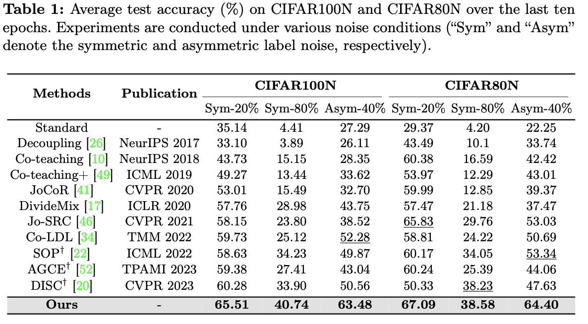

# Re-thinking the Label Memorization in Noisy Label Learning: An Asymmetric Co-Training Optimization Strategy
**Abstract:** Label noise is inevitable in classification model learning, particularly when dealing with large-scale database annotations obtained through web-crawling or crowd-sourcing. 
The symmetric co-training optimization strategy is widely adopted by existing methods, leveraging the diverse learning capabilities of the two models to guide each other during training.
However, the additional learning information gained from different random initializations is very limited, and the models tend to converge in the later stages.
To this end, we propose an Asymmetric Co-Training Optimization strategy, called ACTO, to deal with label noise.
Specifically, we simultaneously train two models but employ robust (i.e., training under the selected clean subset) and non-robust (i.e., training under the entire noisy dataset) training strategies separately. 
Through a positive feedback mechanism, we design an asymmetric sample selection criteria to continually optimize the robust model's performance against label noise.
To better exploit the diverse learning information offered by the non-robust model, we propose mining more valuable "clean" samples for the robust model before the non-robust model undergoes label memorization.
Besides, we design a self-adaptive metric to measure the degree of label memorization exhibited by the non-robust model.
Finally, we propose utilizing the historical training states to foster the reliability and adaptivity of the selected and mined "clean" samples following our ACTO.
Extensive experimental results on synthetic and real-world datasets demonstrate the effectiveness and superiority of our proposed method.


# Pipeline
The differences between existing symmetric co-training optimization strategies :


The overall framework of our proposed ACTO:


# Installation
```
pip install -r requirements.txt
```

# Datasets
We conduct noise robustness experiments on a synthetically corrupted dataset (i.e., CIFAR100N) and four real-world datasets (i.e., Web-Aircraft, Web-Car, Web-Bird and Food101N).
Specifically, we create the noisy dataset CIFAR100N based on CIFAR100.
We adopt two classic noise structures: symmetric and asymmetric, with a noise ratio $n \in (0,1)$.

You can download the CIFAR10 and CIFAR100 on [this](https://www.cs.toronto.edu/~kriz/cifar.html).

You can download Web-Aircraft, Web-Car, and Web-Bird from [here](https://github.com/NUST-Machine-Intelligence-Laboratory/weblyFG-dataset).

You can download Food101N from [here](https://kuanghuei.github.io/Food-101N/).

# Training

An example shell script to run ACTO on CIFAR-100N :

```python
main.py --gpu 0  --noise-type symmetric --closeset-ratio 0.2 --dataset cifar100nc
```
An example shell script to run ACTO on CIFAR-80N :

```python
main.py --gpu 0  --noise-type symmetric --closeset-ratio 0.2 --dataset cifar80no
```
Here is an example shell script to run ACTO on Web-Aircraft :

```python
main_web.py --gpu 0 --dataset web-aircraft
```

Here is an example shell script to run ACTO on Food101N :

```python
main_food101n.py --gpu 9  --warmup-epoch 5 --epoch 50 --batch-size 100 --lr 0.0005 --lr1 0.001 --warmup-lr 0.001  --lr-decay cosine:5,5e-5,50 --opt sgd --dataset food101n
```

# Results on Cifar100N:




# Results on Web-Aircraft, Web-Bird, and Web-Car:


# Results on Food101N:


# Effects of different modules on CIFAR100N and CIFAR80N under various noise conditions.:


